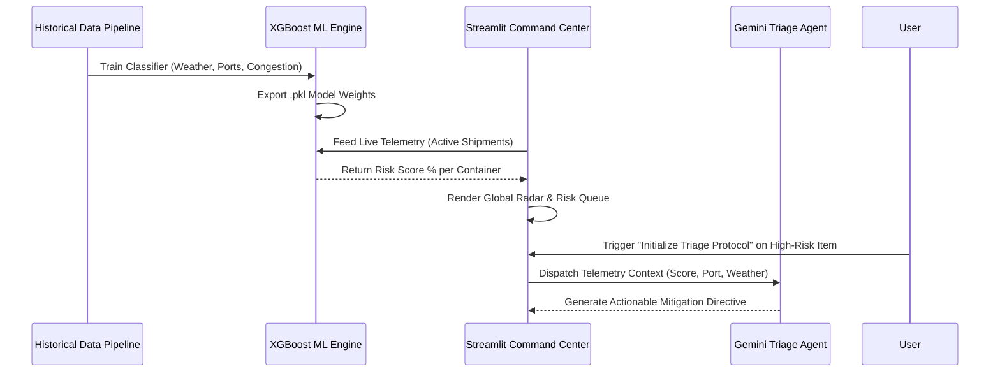

<div align="center">

# ⚡ Predictive Supply Chain Nervous System
**Machine-Learning-Driven Logistics Prediction & Autonomous Operational Triage**

[](#)
[](#)
[](https://streamlit.io/)
[](https://ai.google.dev/)
[](#)
[](#)

*An enterprise-grade, full-stack predictive architecture designed to intercept logistics failures before they occur. It bridges raw supply chain telemetry with proactive, AI-driven mitigation strategies.*

</div>

## 📑 Table of Contents
- [Business Value & Overview](#-business-value--overview)
- [System Architecture](#-system-architecture)
- [Key Features](#-key-features)
- [Tech Stack](#-tech-stack)
- [Design Philosophy & UI/UX](#-design-philosophy--uiux)
- [Local Development Setup](#-local-development-setup)
- [Environment Variables](#-environment-variables)
- [Deployment Strategy](#-deployment-strategy)
- [Roadmap](#-roadmap)

---

## 🎯 Business Value & Overview
The traditional supply chain relies on reactive operations—scrambling to address delays, stockouts, and logistics failures *after* they cascade into the Bullwhip Effect. 

This system transforms logistics from reactive to predictive. By leveraging an XGBoost classifier trained on extensive historical supply chain data, the system scores active shipments with a real-time "Delay Probability." High-risk anomalies are visualized geographically, and an integrated LLM triage agent automatically drafts technical mitigation directives to reroute or expedite critical cargo, saving millions in operational downtime.

---

## 🏗 System Architecture

The pipeline operates on a decoupled architecture, separating data synthesis, deterministic machine learning inference, and generative AI triage.



---

## ✨ Key Features

* **Deterministic Risk Scoring:** A trained XGBoost model evaluates real-time container weights, route distances, port congestion indexes, and weather patterns to output a precise delay probability.
* **Global Anomaly Radar:** Interactive `Folium` mapping overlays active shipments onto a geographic coordinate system, clustering high-risk routes for immediate visual identification.
* **Autonomous AI Triage:** Replaces manual crisis management by using advanced LLMs to instantly generate specific, actionable rerouting and buffering strategies for flagged shipments.
* **Synthetic Telemetry Engine:** Includes a robust Python data pipeline to programmatically simulate complex supply chain variables and generate training datasets.

---

## 💻 Tech Stack

| Component | Technology | Purpose |
| --- | --- | --- |
| **Machine Learning** | `scikit-learn`, `XGBoost` | Feature engineering, classification training, and predictive inference. |
| **Data Processing** | `Pandas`, `NumPy` | Mass data structuring and operational metrics calculation. |
| **Generative AI** | `Google Gemini API` | Autonomous drafting of operational mitigation directives. |
| **Visualization** | `Streamlit`, `Folium`, `Plotly` | Interactive geographic mapping and dashboard reactivity. |
| **Infrastructure** | `Hugging Face CLI` | Zero-downtime containerized cloud deployment. |

---

## 🎨 Design Philosophy & UI/UX

The front-end interface is engineered with a strict **Industrial Zen / Cinematic Dark Mode** aesthetic. Utilizing deep charcoal backgrounds, glassmorphism paneling, and emerald green data accents, the UI minimizes visual fatigue for operations managers while maintaining a highly professional, command-center feel.

---

## 🛠 Local Development Setup

To run the pipeline sequentially in a local environment or Codespace:

1. **Clone the repository**
```bash
git clone [https://github.com/anberaziz5/supply-chain-nervous-system.git](https://github.com/anberaziz5/supply-chain-nervous-system.git)
cd supply-chain-nervous-system

```


2. **Install dependencies**
```bash
pip install -r requirements.txt

```


3. **Generate Historical Data** (Simulates operational telemetry)
```bash
python data/generate_data.py

```


4. **Train the ML Engine** (Generates `.pkl` weights)
```bash
python models/train.py

```


5. **Boot the Command Center**
```bash
python -m streamlit run frontend/app.py

```


---

## 🔐 Environment Variables

Create a `.env` file in the root directory. The application requires the following secret to power the Triage Agent:

| Variable | Description | Where to get it |
| --- | --- | --- |
| `GEMINI_API_KEY` | Authenticates requests to the generative triage model. | [Google AI Studio](https://aistudio.google.com/) |

> **Security Note:** `.env` files are explicitly ignored in version control to protect API credentials.

---

## 🚀 Deployment Strategy

This architecture is optimized for a modular cloud deployment via the Hugging Face command line interface.

**Zero-Click CLI Deployment:**

```bash
hf upload YOUR_HF_USERNAME/supply-chain-nervous-system . . --repo-type space --exclude ".git/*" --exclude "venv/*" --exclude "__pycache__/*"

```

The remote environment automatically reads the YAML frontmatter in this `README.md` to provision the Streamlit container and expose the application port.

**Portfolio Integration:** The application can be seamlessly white-labeled and embedded into a custom subdomain (e.g., `ops.yourdomain.com`) using an `iframe` with the `?embed=true` URL parameter to bypass native platform UI wrappers.

---

## 🗺 Roadmap

* [x] XGBoost classification for shipment delay prediction.
* [x] Geographic anomaly visualization (Folium).
* [x] LLM-integrated operational triage pipeline.
* [ ] Connect ingestion pipeline to live maritime AIS (Automatic Identification System) APIs.
* [ ] Implement deep reinforcement learning for dynamic route optimization.
* [ ] Add multi-modal inputs (e.g., ingesting PDF bills of lading).

---

*Built by a Systems Architect & Automation Expert leveraging a background in Operations Management to build business-aligned automation.*